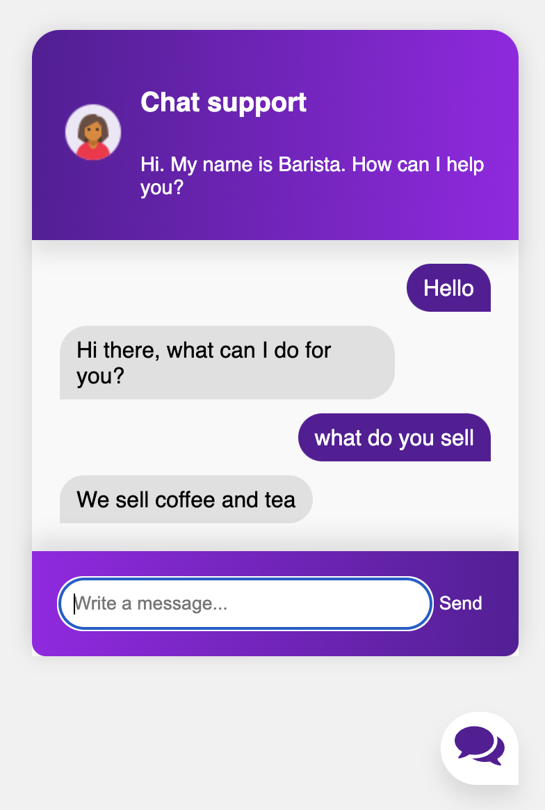

# Chatbot
 Python chatbot for websites
<hr>

<hr>

## Initial Setup
<hr>

Clone repo and create a virtual environment
```
$ git clone https://github.com/giedriusstankauskas/chatbot.git
$ cd chatbot
$ python3 -m venv venv
$ . venv/bin/activate
```
Install dependencies
```
$ (venv) pip install requirements.txt
```
Modify `intents.json` with different questions and responses for your Chatbot

Run
```
$ (venv) python train.py
```
This will dump data.pth file.
```
$ (venv) python chat.py
```

Start Flask app.
```
$ (venv) export FLASK_APP=app.py
$ (venv) flask run
```